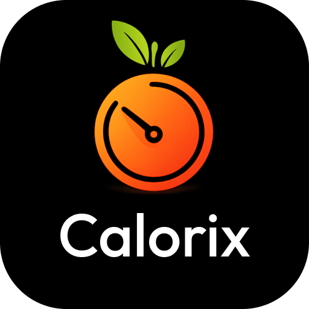
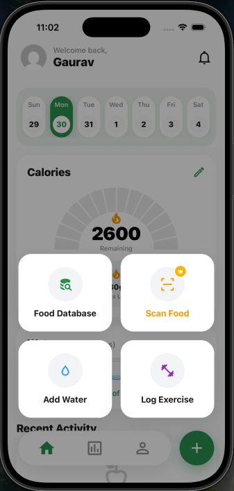
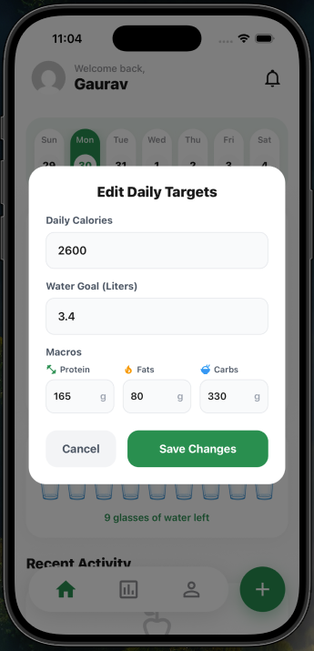
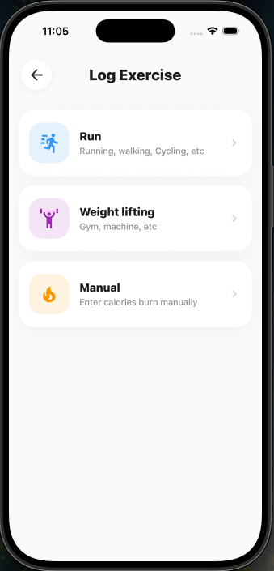
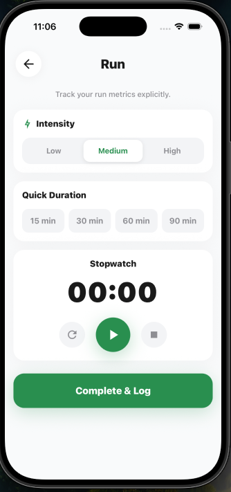
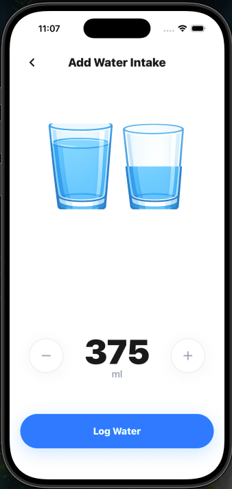
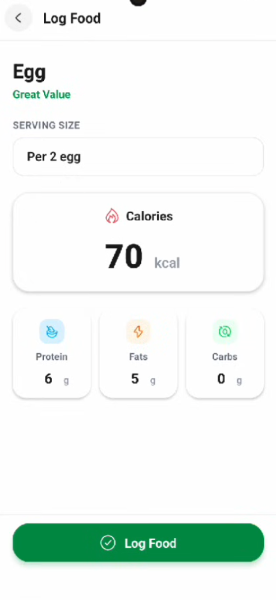

# Welcome to AI Cal Tracker 👋

<p align="center">
  
</p>

<p align="center">
  An AI-powered calorie tracking app built with <b>React Native + Expo</b> that turns onboarding data into a personalized nutrition plan, then helps users log food, water, and workouts through a clean mobile-first experience.
</p>

<p align="center">
  
  
  
</p>

## What this app does

AI Cal Tracker helps users move from setup to action in one flow:

- create an account,
- complete onboarding with body and goal details,
- generate a personalized daily nutrition blueprint,
- track meals, hydration, and workouts,
- review daily progress against calorie and macro targets.

The app is designed as a polished mobile experience rather than a simple form-based tracker.

## Key features

### 1. Authentication and user onboarding

- Email/password sign up and sign in using Firebase Authentication.
- Persistent auth session handling for React Native.
- Smart route protection with Expo Router.
- Multi-step onboarding that collects gender, goal, workout frequency, DOB, height, and weight.
- Onboarding completion is cached locally for smoother app startup.

### 2. AI-generated nutrition blueprint

- After onboarding, the app calls OpenAI to generate a personalized plan.
- The generated plan includes:
  - daily calorie target,
  - protein, carbs, and fats targets,
  - water intake goal,
  - BMI,
  - personalized fitness tip.
- The generated plan is stored in Firestore and used to power the dashboard.

### 3. Daily tracking dashboard

- Home dashboard loads user targets and daily logs for the selected date.
- Interactive date selector for browsing logs day by day.
- Visual calorie progress card with remaining calories and macro balance.
- Editable targets so users can adjust calories, water, and macros after plan generation.
- Recent activity section showing logged meals and exercises.

### 4. Food logging with FatSecret integration

- Search food items using the FatSecret API.
- Custom OAuth 1.0 signing implemented directly in the app.
- Pulls food name, brand, serving description, calories, protein, fats, and carbs.
- Users can select a result, adjust serving quantity, and save it to their daily log.

### 5. Water tracking

- Quick-add water logging flow.
- Tracks hydration as glasses and supports milliliter-based storage as well.
- Water goal is connected to the personalized AI plan.

### 6. Exercise logging

- Users can log workouts in two ways:
  - manual calorie entry,
  - guided logging with type, intensity, and duration.
- Guided exercise flow estimates calories burned using user profile metrics such as age, weight, gender, and workout intensity.
- Logged exercise data updates daily burned calories and activity history.

### 7. Clean mobile UX

- Built with Expo Router file-based navigation.
- Floating custom tab bar and action menu for fast logging.
- Modular UI components for dashboard, hydration, recent activity, and navigation.
- Styled for a premium, consumer-facing fitness app feel.

## Current app structure

```text
src/
  app/
    (auth)/        # sign in / sign up
    (main)/        # home, analytics, profile
    onboarding     # multi-step onboarding
    calculating-plan
    add-log        # food search
    log-food
    add-water
    log-exercise
    log-exercise-details
    log-exercise-manual
    log-exercise-success
  components/      # reusable dashboard and navigation UI
  config/          # Firebase setup
  context/         # auth state provider
  services/        # FatSecret, logs, user profile logic
  stores/          # onboarding cache
```

## Tech stack

**Frontend**

- React Native
- Expo
- Expo Router
- TypeScript

**Backend / Cloud**

- Firebase Authentication
- Cloud Firestore

**AI / External APIs**

- OpenAI Chat Completions API
- FatSecret API

**State / Persistence**

- React Context
- AsyncStorage

**UI / Libraries**

- React Navigation
- React Native SVG
- Expo Vector Icons / Lucide / Hugeicons

## Techniques used in the code

- File-based routing with protected auth and main app flows.
- Persistent session management in React Native Firebase auth.
- Firestore document modeling for user profiles and date-based daily logs.
- Async local caching for onboarding state and selected date context.
- OAuth 1.0 request signing for third-party API access.
- AI-generated structured JSON plans stored and reused in the app.
- Dynamic dashboard rendering from per-day aggregated logs.
- Formula-based workout calorie estimation using user metrics and intensity.

## Upcoming features

These are either clearly hinted at or partially scaffolded in the current codebase:

- Analytics dashboard with charts and long-term progress insights.
- Native Google Sign-In flow.
- Food scanning / camera-based logging for premium users.
- Deeper health insights and richer AI coaching on top of historical logs.

## Why this project

This is not just a calorie logger. It combines **AI personalization**, **real user data persistence**, **nutrition search**, **exercise estimation**, and a **production-style mobile architecture** into one app. The result is a stronger portfolio project because it demonstrates both product thinking and implementation across mobile, AI, APIs, and cloud storage.

## Setup

```bash
npm install
npx expo start
```

Required environment variables include Firebase config, OpenAI API key, and FatSecret credentials.

## Screenshots

You can keep this section and replace the paths with your final exports:

## Screenshots

<p align="center">
  
  
  
</p>

<p align="center">
  
  
</p>
